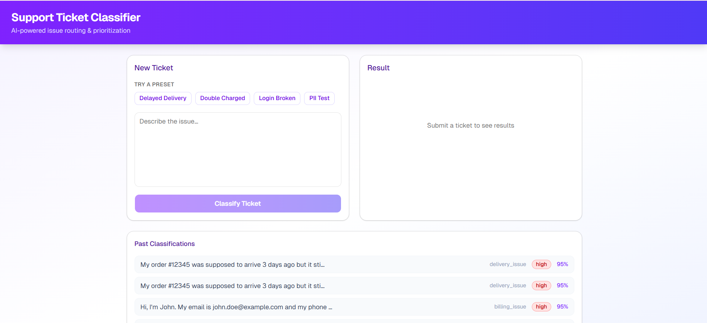

# AI Ticket Classifier

An intelligent support ticket classification system powered by Claude AI and LangGraph. Analyzes customer support tickets to extract structured insights automatically.

## Screenshot



## Features

- **Classification** — Detects issue category, priority level, and assigned team
- **Sentiment analysis** — Scores customer sentiment from the ticket text
- **PII redaction** — Automatically masks personally identifiable information
- **Injection detection** — Flags prompt injection attempts
- **Confidence scoring** — Surfaces low-confidence results for human review
- **History tracking** — Stores and retrieves past classification results

## Tech Stack

| Layer | Tech |
|-------|------|
| Backend | FastAPI, LangGraph, Anthropic Claude API, SQLAlchemy |
| Frontend | React 19, TypeScript, Vite, Tailwind CSS |

## Project Structure

```
├── backend/
│   ├── app/
│   │   ├── main.py           # FastAPI entry point
│   │   ├── routers/          # API route handlers
│   │   ├── graph/            # LangGraph pipeline (nodes, state, prompts)
│   │   └── schemas.py        # Pydantic models
│   └── requirements.txt
└── frontend/
    ├── src/
    │   └── App.jsx           # Main React component
    └── package.json
```

## Getting Started

### Prerequisites

- Python 3.11+
- Node.js 18+
- An [Anthropic API key](https://console.anthropic.com/)

### Backend

```bash
cd backend
pip install -r requirements.txt
```

Create a `.env` file in `backend/`:

```env
ANTHROPIC_API_KEY=your_api_key_here
```

```bash
python -m app.main
# Server runs at http://localhost:8000
```

### Frontend

```bash
cd frontend
npm install
npm run dev
# App runs at http://localhost:5173
```

## API Reference

| Method | Endpoint | Description |
|--------|----------|-------------|
| `POST` | `/api/classify` | Classify a support ticket |
| `GET` | `/api/history` | Retrieve classification history |
| `GET` | `/health` | Health check |

### Example Request

```bash
curl -X POST http://localhost:8000/api/classify \
  -H "Content-Type: application/json" \
  -d '{"text": "My payment failed and I was charged twice."}'
```

### Example Response

```json
{
  "category": "Billing",
  "priority": "High",
  "sentiment": "Negative",
  "assigned_team": "Finance",
  "confidence": 0.94,
  "requires_human_review": false,
  "redacted_text": "My payment failed and I was charged twice."
}
```
